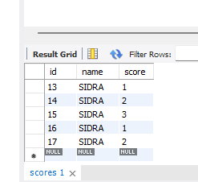
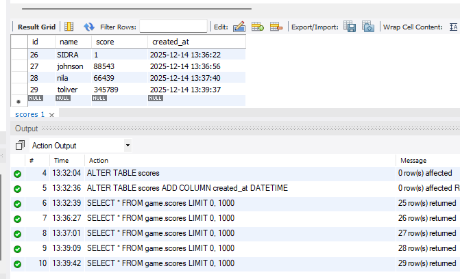
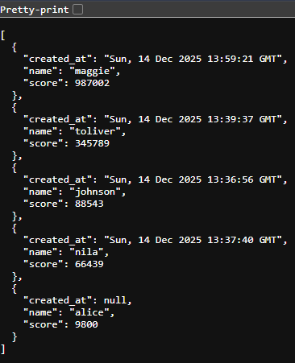
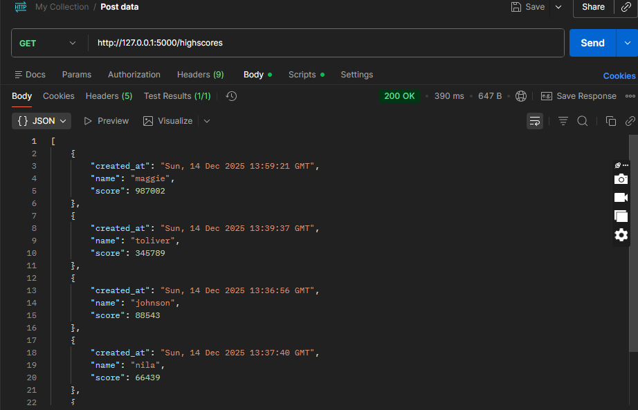

# Mini Square Game - Flask + p5.js + MySQL

A simple web-based mini game built with **p5.js** for the frontend and **Flask + MySQL** for the backend. Players click on a moving square to increase their score, which is stored in a MySQL database along with the date and time.  

---

## Features ✨

- Click the square to increase your score.  
- Score is sent to a MySQL database automatically.  
- Stores **player name**, **score**, and **date/time** of play.  
- Displays top 5 high scores.  

---

## How To Play 🎮

- Simply click on the square to increase your score, with every click, scores are sent to MySQL database and stored in it

---

## Data Being Sent to Database and Stored In Database (name, score)

- 

## Data Being Sent To Database and Stored In Database (name, score, date&time)

- 

## Data Being Taken Out From Database (name, score, date&time)

- 

## Flask Routes Being Tested With Postman API

- 

